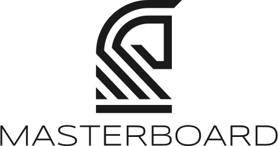

<p align="center">
  <picture>
    <source media="(prefers-color-scheme: dark)" srcset="frontend/src/assets/logo-full-light.svg">
    
  </picture>
</p>

A desktop chess application for serious players. Manage your opening repertoire, record and analyse games, drill with spaced-repetition training, and explore positions against a master game database — all in one integrated tool.

**Platforms:** Windows · macOS · Linux

## Download

Pre-built installers are available on the [Releases](https://github.com/IntermezzoSoftware/Masterboard/releases) page.

## Features

- **Game library** — import games from Chess.com and Lichess, or from PGN files; organise with folders and collections; bulk analysis with engine-powered accuracy scoring and move classification
- **Board & analysis** — real-time engine evaluation with WDL bar, multi-PV lines, and best-move arrows; full annotation support (NAG symbols, comments, board shapes); draggable workspace panels
- **Opening repertoire** — build repertoires by colour with an interactive move tree; import and export Polyglot `.bin` books; import from Lichess Studies; explore your preparation against master games and personal game history side-by-side
- **Spaced-repetition drill** — train your repertoire with the FSRS v4 algorithm; branch-level and full-repertoire sessions; coverage heatmap showing retention per move; pre-tournament "Review All" mode
- **Position explorer** — three-tab explorer (Master DB · My Games · Repertoire) showing candidate moves with W/D/L stats, average Elo, and example games at any board position; supports large PGN collections (tested at 1.9M+ games)
- **Personal statistics** — accuracy trends, blunder heatmap, results by colour/time control/opening, luck and opportunism rates; opening deviation detection with repertoire divergence overlay

## Building from Source

**Prerequisites**

- [Go](https://go.dev/) 1.23+
- [Node.js](https://nodejs.org/) 20+
- [Wails CLI](https://wails.io/docs/gettingstarted/installation): `go install github.com/wailsapp/wails/v2/cmd/wails@latest`
- [Task](https://taskfile.dev): `go install github.com/go-task/task/v3/cmd/task@latest`
- **Windows only**: MinGW-w64 via [MSYS2](https://www.msys2.org/) (required for CGo/SQLite)
- Run `wails doctor` to verify your environment

**Development** (hot reload)

```bash
task install
task dev
```

**Production build**

```bash
task build
```

Output: `build/bin/Masterboard` (or `Masterboard.exe` on Windows).

## Testing

```bash
task test       # Go unit tests
task test:fe    # Frontend unit tests (Vitest)
task e2e        # Playwright E2E tests
```

## Engine Setup

Place a [Stockfish](https://stockfishchess.org/) binary (or any UCI-compatible engine) in an `engines/` folder next to the app binary. In dev mode that is `build/bin/engines/`. Engines can also be downloaded directly from the Settings page.

## Contributing

Bug reports and feature requests are welcome — please open an issue. The codebase is source-available but not currently accepting pull requests.

## License

[GPL-3.0](LICENSE)
